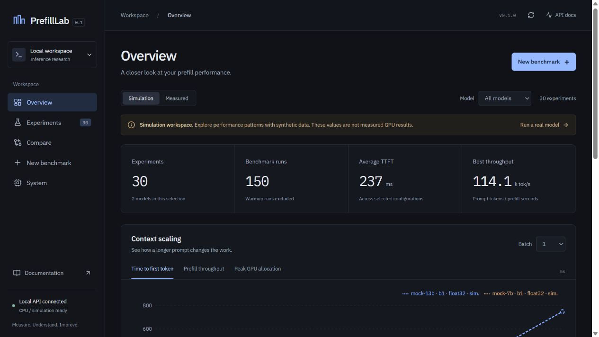

# PrefillLab

**Understand where your LLM prefill time goes.**

PrefillLab is an open-source profiling, benchmarking, and visualization toolkit for local LLM prefill workloads. Measure time to first token, prefill latency, throughput, memory, and module execution; explore context and batch scaling through a CLI, Python API, and dashboard.

Version 0.1.0 · Python 3.11+ · Apache-2.0 · CPU-friendly simulation



## Quick start

```bash
git clone https://github.com/hanshuqimen/PrefillLab.git
cd PrefillLab
python -m venv .venv
# Linux/macOS: source .venv/bin/activate
# Windows PowerShell: .venv\Scripts\Activate.ps1
pip install -e .
prefilllab doctor
prefilllab run --backend mock --model mock-7b --input-length 8192 --output result.json
prefilllab report result.json
prefilllab serve --demo
```

Open http://localhost:8000. The dashboard bundle is included in the repository and Python wheel; Node is needed only to develop the frontend. Simulation never downloads a model or requires CUDA. Every simulated result is explicitly labeled.

## Why PrefillLab?

One latency number cannot tell you whether long contexts change attention cost, whether batching helps throughput, or what consumes device memory. PrefillLab preserves raw samples, environment metadata, clear timing boundaries, and cautious heuristic explanations so those questions can be investigated reproducibly.

## Features

- Deterministic, parameterized mock backend for teaching, CI, and UI development.
- Real decoder-only Transformers inference, cached decode, CPU/CUDA timing, and optional profiling.
- Warmups, repeated samples, mean/median/p50/p90/min/max/population standard deviation.
- Exclusive nested module hooks/events and a separate PyTorch operator profiling pass.
- SQLite history, JSON/CSV export, standalone HTML reports, and context/batch scaling analysis.
- Dark React dashboard with experiment history, detail, comparison, benchmark creation, and system diagnostics.
- Extensible backend factory, module classification rules, profiler protocol, and optimization advisor.

## CLI

```bash
prefilllab --help
prefilllab doctor --format json
prefilllab run --backend mock --model mock-7b --format json --output result.json
prefilllab sweep --backend mock --input-lengths 512,1024,2048,4096 --batch-sizes 1,2,4
prefilllab compare result1.json result2.json
prefilllab report result.json --output prefilllab-report.html
prefilllab serve --demo --port 8000
```

`run` persists history and can write JSON. `sweep` writes one JSON and CSV per experiment, an aggregate `sweep.csv`, and `scaling.json`. JSON success output contains the versioned experiment schema; progress goes to stderr. JSON failures use `{"error": {"type": "...", "message": "..."}}` and a nonzero exit code. Missing optional packages do not make `doctor` fail. Use `--verbose` before the command for debug logging.

## Real models

```bash
pip install -e '.[transformers]'
prefilllab run --backend transformers --model gpt2 --device cpu --dtype float32 --input-length 256
# With a CUDA-compatible PyTorch installation:
prefilllab run --backend transformers --model YOUR_MODEL --device cuda --dtype float16 --input-length 2048
```

Install the PyTorch build appropriate for your platform. Model downloads are explicit, may need Hugging Face authentication, and respect model licenses. Remote model code is disabled. Inputs use legal non-special tokenizer IDs within the embedding vocabulary. Context limits are validated. CPU float16 is rejected with an actionable message; use float32 or bfloat16. `--no-profile` disables separate instrumented passes.

## Python API

```python
from prefilllab import Benchmark, Sweep

result = Benchmark(model="mock-7b", backend="mock").run(input_length=4096, batch_size=1)
print(result.ttft_ms)
print(result.model_dump_json(indent=2))
results = Sweep(input_lengths=[512, 1024, 2048, 4096], batch_sizes=[1, 2]).run()
```

See [examples](examples) for CSV export and model comparison.

## Dashboard and API

`prefilllab serve --demo` adds a deterministic sample set once while preserving existing history. Simulated and measured experiments are grouped separately in charts and filters. New Benchmark runs a synchronous request; a busy state is shown until it completes. Errors preserve the entered configuration. `/api/docs` provides OpenAPI documentation.

API routes: `GET /api/health`, `GET/POST /api/experiments`, `GET/DELETE /api/experiments/{id}`, `POST /api/benchmarks/run`, `GET /api/system`, `GET /api/backends`, `GET /api/models`. List queries support `limit` and `offset`. Import accepts a validated v1 result. Benchmark runs are serialized within one server process to prevent GPU interference.

The server binds to loopback by default and is a trusted local research tool. It has no user authentication; place it behind access controls before any remote exposure. Model loading occurs only through an explicit benchmark request. Set `PREFILLLAB_ALLOW_REAL_MODELS=1` to allow real-model runs through the HTTP API; CLI/Python always support explicit real runs.

## Architecture

```text
ExperimentConfig → backend → Benchmark
                             ├ timing / memory / NVML
                             └ separate module / operator profiling
                         → ExperimentResult → analysis / recommendations
                                            → SQLite / JSON / CSV
                                            → CLI / API / HTML / React
```

Core logic lives in `prefilllab/core`; backends, profilers, classification, analysis, storage, reports, and API are independent packages. `register_backend(name, factory)` adds an adapter. Extend `ModuleClassifier(rules=[(regex, category)])` for naming conventions. Research scripts live under `benchmarks/` separately from the product.

## Metrics and methodology

See [methodology](docs/methodology.md) for timing boundaries, profiler caveats, memory definitions, and reproducibility limits. Local TTFT starts after synthetic inputs have been prepared and transferred, includes the prefill forward, synchronization and greedy first-token selection, and excludes downloads, tokenization, networking, queueing, and scheduling. Decode uses the KV cache and does not affect TTFT. Requests generate a fixed number of tokens, ignoring EOS, to maintain workload consistency.

Throughput is prompt tokens divided by mean prefill seconds. GPU memory is PyTorch allocated memory in MiB, with peak covering the measured request series including decode. CPU GPU metrics are null. NVML memory utilization is sampled activity, distinct from capacity percent. Kernel/operator statistics and module breakdown come from separate instrumented runs; they are not added to latency measurements. No compute-bound or memory-bandwidth diagnosis is asserted without hardware counters. Recommendations are hypotheses, with evidence and confidence, and never alter model execution.

## Storage

Default: `~/.prefilllab/prefilllab.db`. Override with `PREFILLLAB_DB=/path/to/file.db` or `PREFILLLAB_DB=sqlite:///path/to/file.db`. JSON records preserve all samples, configuration, environment, warnings, and schema version. Do not share databases with untrusted users. Exported environment metadata may contain system identifiers; review before sharing.

## Supported backends

| Backend | Status | Base install |
|---|---|---|
| Mock | Implemented; simulated only | Yes |
| Transformers | Implemented; CPU and single CUDA device | Optional extra |
| vLLM / SGLang | Future adapters; detected by doctor, not runnable | No |

No distributed runtime, serving scheduler, real prefix-cache measurement, Nsight parser, or full roofline model is included in v0.1.0.

## Development

```bash
pip install -e '.[dev]'
pytest
ruff check .
ruff format --check .
mypy prefilllab
python -m build
# Optional real CPU tests use a tiny randomly initialized local model, no download:
pip install -e '.[transformers]'
pytest -m integration
```

Backend: `uvicorn prefilllab.api.app:app --reload`. Frontend: `cd frontend && npm install && npm run dev`. Vite proxies `/api` to port 8000. `npm run build` writes the packaged dashboard to `prefilllab/web`. `make install`, `make test`, `make lint`, `make frontend`, and `make dev` are provided. CI builds the frontend, checks types/lint, runs CPU tests on Python 3.11/3.12, validates real local Transformers inference, and builds the wheel.

## Roadmap

Serving-engine adapters; workload replay; queue-aware TTFT; chunked prefill and prefix-cache experiments; GPU trace export; multi-device topology metadata; hardware-counter and roofline analysis. Interfaces are extensible, but roadmap entries are not implemented capabilities.

## Contributing and license

Read [CONTRIBUTING.md](CONTRIBUTING.md), [CODE_OF_CONDUCT.md](CODE_OF_CONDUCT.md), and [SECURITY.md](SECURITY.md). Licensed under [Apache-2.0](LICENSE).
